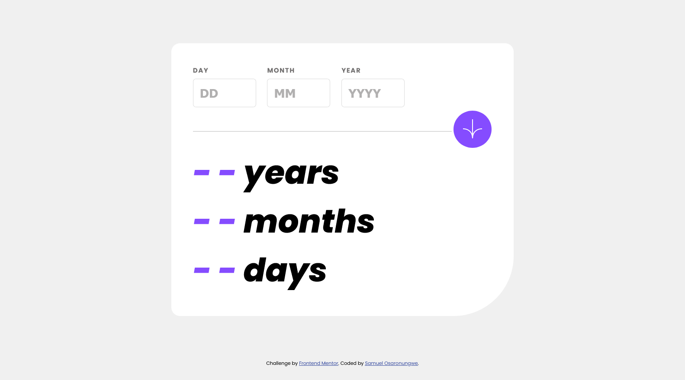
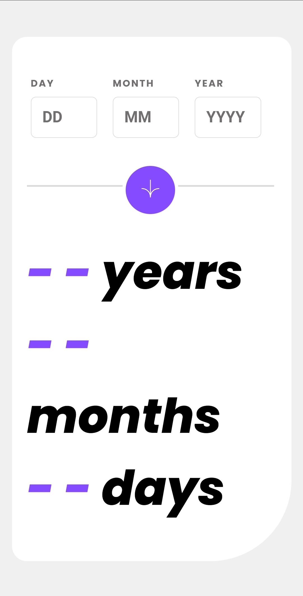

# Frontend Mentor - Age calculator app solution

This is a solution to the [Age calculator app challenge on Frontend Mentor](https://www.frontendmentor.io/challenges/age-calculator-app-dF9DFFpj-Q). Frontend Mentor challenges help you improve your coding skills by building realistic projects. 

## Table of contents

- [Overview](#overview)
  - [The challenge](#the-challenge)
  - [Screenshot](#screenshot)
  - [Links](#links)
- [My process](#my-process)
  - [Built with](#built-with)
  - [What I learned](#what-i-learned)
  - [Continued development](#continued-development)
  - [Useful resources](#useful-resources)
- [Author](#author)
- [Acknowledgments](#acknowledgments)

## Overview

### The challenge

Users should be able to:

- View an age in years, months, and days after submitting a valid date through the form
- Receive validation errors if:
  - Any field is empty when the form is submitted
  - The day number is not between 1-31
  - The month number is not between 1-12
  - The year is in the future
  - The date is invalid e.g. 31/04/1991 (there are 30 days in April)
- View the optimal layout for the interface depending on their device's screen size
- See hover and focus states for all interactive elements on the page
- **Bonus**: See the age numbers animate to their final number when the form is submitted

### Screenshot




### Links

- Solution URL: [Github Link](https://github.com/sicktooth/age-calculator-app)
- Live Site URL: [Add live site URL here](https://sicktooth.github.io/age-calculator-app/)

## My process

### Built with

- Semantic HTML5 markup
- CSS custom properties
- CSS Grid
- Desktop-first workflow
- Javascript

### What I learned

The Age calculator app was a good challenge for testing form validation, javascript and working with dates of which gave me a tough time to figure out.

The first problem that I faced was after user inputs, the form should not be submitted of which I accomplished with the ```e.preventDefault()``` method.

The second problem that I encountered was adding animations to the page after data has been calculated but with the help of a youtube video I learnt how to do that with the ```updateDisplay()``` function:

```js
function updateDisplay(){
        const counters = document.querySelectorAll(".counter");
        counters.forEach(function (counter) {
            let initial_count = -1;
            const final_count = counter.dataset.count;

            const counting = setInterval(updateCounting, 40);

            function updateCounting(){
                initial_count++;
                
                counter.innerText = initial_count; 
                
                if (initial_count == final_count) {
                    clearInterval(counting);
                }
            }
        });
    }
```

### Continued development

I want to continue sharpening my JS skills and including accessibility best practices. I'm also really interested in growing my animation skills.

### Useful resources

- [CodingDesign Number Counting Animation](https://www.youtube.com/watch?v=WfDIU93fN3o) - This helped me in achieving the animation.

## Author

- Website - [Samuel Osaronungwe](https://sicktooth.github.io/portfolio/)
- Frontend Mentor - [@sicktooth](https://www.frontendmentor.io/profile/sicktooth)
- Twitter - [@sammy_o_osaro](https://twitter.com/Sammy_O_Osaro)

## Acknowledgments

Thanks so much to Jeet Saru at CodingDesign and your super helpful YouTube video on Number Counting Animation!